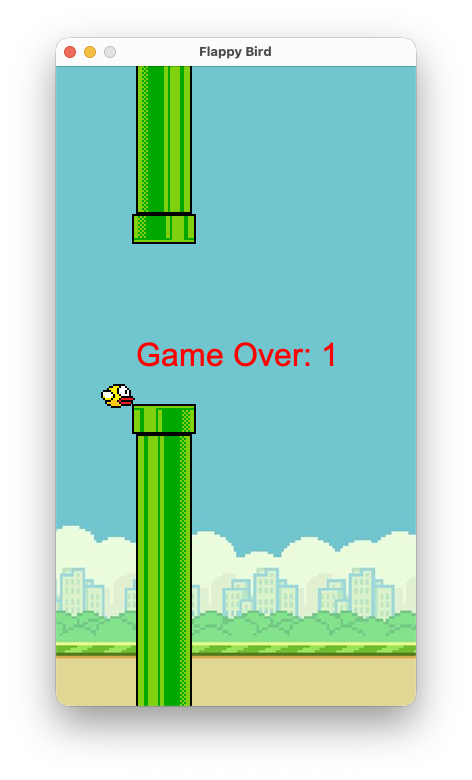

# Flappy Bird

A Java implementation of the classic Flappy Bird game using Swing GUI framework. Navigate a bird through a series of pipes by controlling its vertical movement with simple controls.



## Features

- Classic Flappy Bird gameplay mechanics
- Smooth 60 FPS game loop
- Collision detection system
- Score tracking
- Game over and restart functionality
- Retro-style graphics and animations

## Game Controls

- **SPACE**: Make the bird jump/flap
- **SPACE** (when game over): Restart the game

## Game Mechanics

- **Gravity**: The bird constantly falls due to gravity
- **Flapping**: Pressing SPACE gives the bird upward velocity
- **Pipes**: New pipe pairs spawn every 1.5 seconds
- **Scoring**: Each pipe pair passed awards 1 point
- **Collision**: Game ends when bird hits pipes or ground

## Technical Details

- **Language**: Java
- **GUI Framework**: Swing
- **Game Loop**: 60 FPS using Timer
- **Resolution**: 360x640 pixels
- **Architecture**: Object-oriented design with Bird and Pipe classes

## Getting Started

### Prerequisites

- Java Development Kit (JDK) 8 or higher
- Any Java IDE or text editor (VS Code recommended)

### Running the Game

1. Clone or download this repository
2. Navigate to the project directory
3. Compile the Java files:
   ```bash
   javac -d bin src/*.java
   ```
4. Run the game:
   ```bash
   java -cp bin App
   ```

Alternatively, if using VS Code with Java extensions:
1. Open the project folder in VS Code
2. Press F5 or use "Run Java" to start the game

## Development

The game is built using object-oriented principles:

- **App class**: Handles window setup and application lifecycle
- **FlappyBird class**: Main game panel with rendering and game logic
- **Bird inner class**: Represents the player character
- **Pipe inner class**: Represents obstacle pipes

Key systems implemented:
- Real-time rendering with paintComponent
- Input handling via KeyListener
- Collision detection using bounding box intersection
- Timer-based game loop for consistent frame rate
